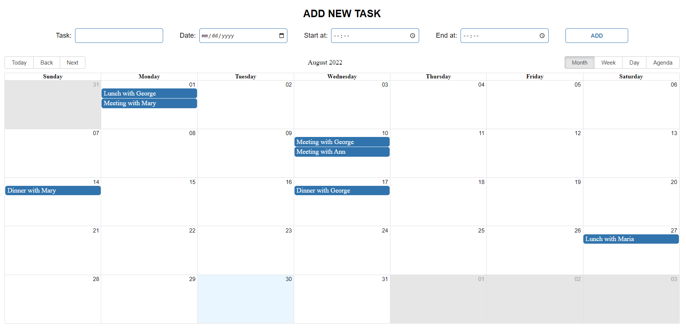
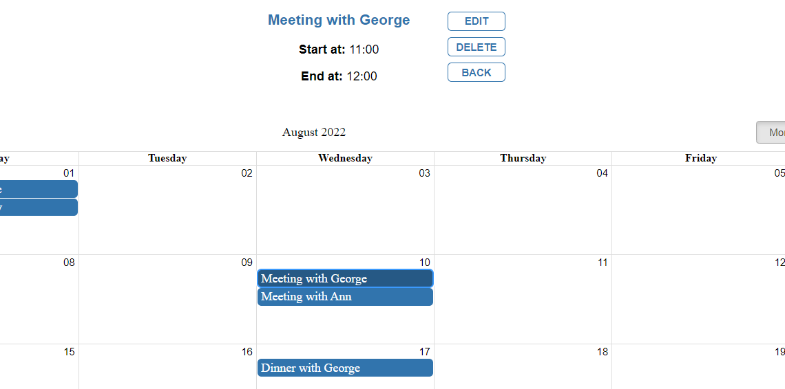
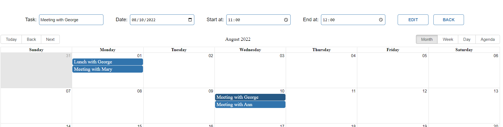

# Calendar
 

A simple Scheduler Application
 

 
 

Allows adding, editing and deleting tasks.
 

When you click on the task, a detail view is displayed. From this view, the user can delete or edit the task, or they can return to the main view.

 
 

Editing the task loads the current data into the form and the user can change it or go back.

 
 

## The front-end part is built with:

* React.js
* HTML & CSS
* react-big-calendar
* date-fns

## For the back-end is used:
[SoftUni Practice Server](https://github.com/softuni-practice-server/softuni-practice-server)

To execute it manually open a command prompt and run `node server.js`.

 
 

## Available Scripts

In the project directory, you can run:

### `npm start`

Runs the app in the development mode.\
Open [http://localhost:3000](http://localhost:3000) to view it in your browser.
